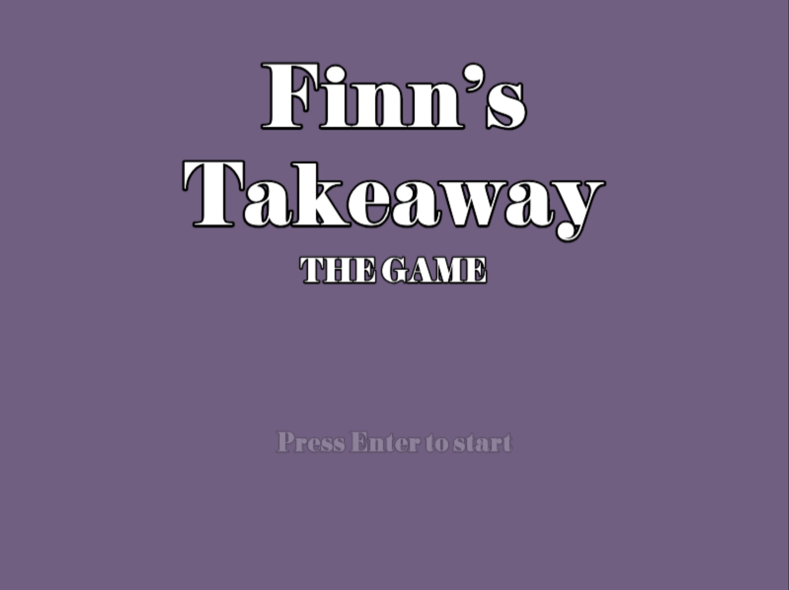
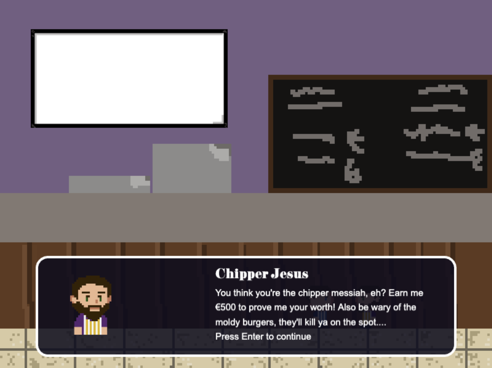
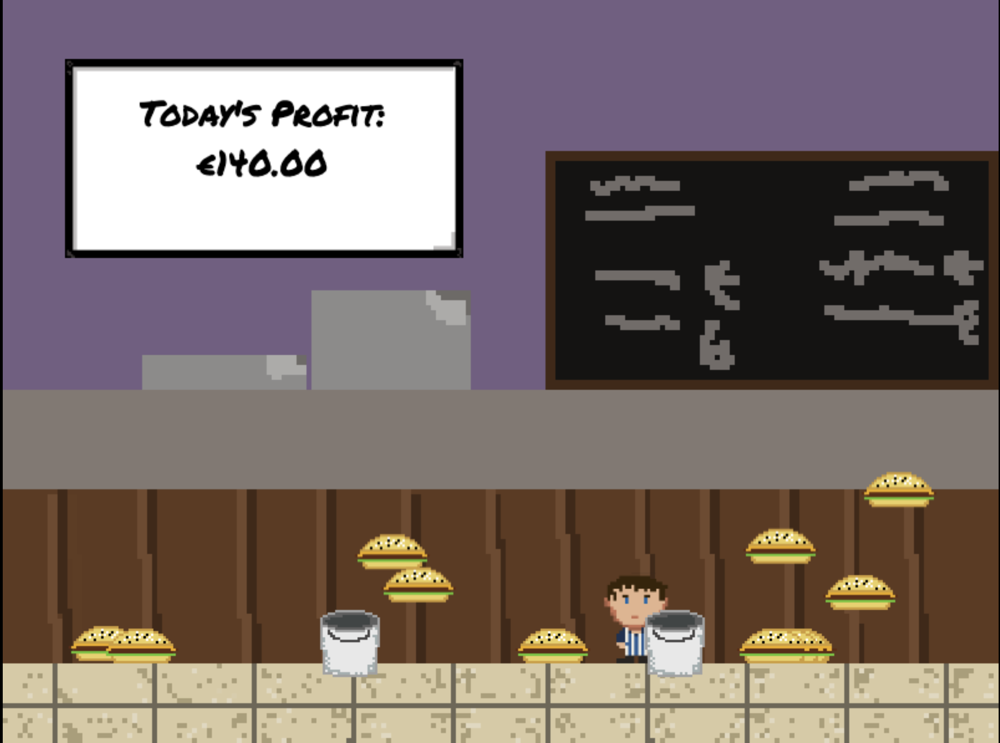

# Finn's Takeaway

Finn's Takeaway is a short Phaser 3 platformer built with Vite. Step into Finn's kitchen, survive Chipper Jesus' initiation test, and flip enough burgers to hit the €500 goal—just make sure the moldy ones never hit the floor.





## Gameplay Overview
- **Intro Screen:** Animated title card and prompt to begin.
- **Cutscene:** Finn strolls into the kitchen while Chipper Jesus sets the challenge.
- **Arcade Stage:** Catch falling burgers before they fall into the bins, and dodge moldy ones.
- **Dynamic Scoreboard:** Tracks profit vs. loss with on-screen commentary.

## Controls
- `←` / `→` to move Finn.
- `↑` to jump when grounded.
- `Enter` to advance through the intro and cutscene.

## Scoring & Rules
- Fresh burgers add €10 to your tally.
- Tossed burgers cost €15 but keep the floor clean.
- Reach €100 to spawn extra bins; €50 summons the first moldy burger.
- Touching a moldy burger ends the shift on the spot.

## Tech Stack
- [Phaser 3.90.0](https://github.com/phaserjs/phaser)
- [Vite 6.3.1](https://github.com/vitejs/vite)
- Vanilla JavaScript modules

## Getting Started
1. Install [Node.js 18+](https://nodejs.org/).
2. Install dependencies:
   ```bash
   npm install
   ```
3. Launch the dev server (defaults to `http://localhost:8080`):
   ```bash
   npm run dev
   ```
4. Build a production bundle:
   ```bash
   npm run build
   ```

| Script | Description |
| --- | --- |
| `npm run dev` | Start the Vite dev server with logging enabled. |
| `npm run dev-nolog` | Dev server without the anonymous Phaser template ping. |
| `npm run build` | Generate an optimized build in `dist/`. |
| `npm run build-nolog` | Production build without the logging step. |

## Project Structure
```
├── public/            # Static assets served as-is
│   ├── assets/        # Sprites, UI art, backgrounds
│   └── style.css      # Global layout styles
├── src/
│   ├── main.js        # Bootstraps the Phaser game
│   └── game/
│       ├── main.js    # Game configuration & scene registration
│       └── scenes/    # Intro, cutscene, and gameplay scenes
├── vite/              # Dev and prod Vite configs
├── index.html         # Root HTML shell
├── package.json       # Scripts and dependencies
└── screenshot.png     # Capture of the current build
```

## Assets & Credits
- Original game code and art were created for this project.
- Built on top of the official Phaser Vite starter template (MIT License).

## Roadmap Ideas
- Add sound effects and music cues.
- Introduce combo multipliers for consecutive catches.
- Expand cutscene dialogue and add win/lose endings.
- Publish the build to itch.io or GitHub Pages.

Have ideas, feedback, or want to collaborate? Open an issue or reach out!
